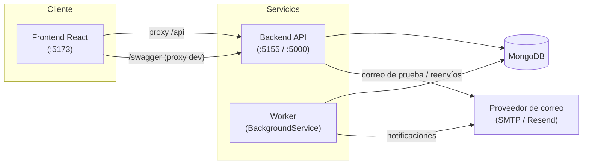
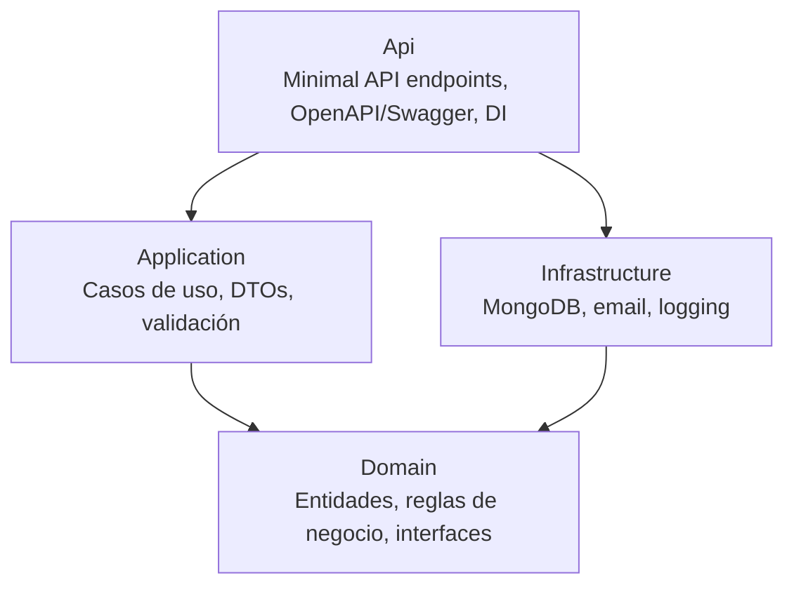

# Arquitectura — Monolegal

Monolegal es una plataforma de gestión de cobranza que automatiza recordatorios de
pago. Sigue **Arquitectura Limpia** (Principio I de la [Constitución](../.specify/memory/constitution.md)):
separación estricta por capas con dirección de dependencias hacia el dominio.

## Componentes del sistema

| Componente | Tecnología | Responsabilidad |
|------------|-----------|-----------------|
| **backend** | ASP.NET Core 10 (Minimal APIs) | API HTTP de facturas, clientes, configuración y transiciones |
| **worker** | ASP.NET Core Hosted Service | Procesa transiciones de estado automáticas y notificaciones por correo |
| **frontend** | React 19 + Vite + TanStack Query + shadcn/ui | Panel de administración (dashboard, facturas, clientes, envíos, configuración) |
| **MongoDB** | MongoDB 8 | Persistencia de clientes, facturas y configuración |



## Capas del backend

El backend se organiza en cuatro capas; las externas dependen de las internas, nunca al revés.



- **Domain** (`backend/Domain`): entidades (`Invoice`, `Client`, `InvoiceItem`, `StatusChange`,
  `SystemSettings`), enums y reglas invariantes (p. ej. `Amount = Σ Items.Subtotal`,
  el cambio de estado como única vía con historial). Sin dependencias externas.
- **Application** (`backend/Application`): casos de uso, DTOs y validación (FluentValidation).
- **Infrastructure** (`backend/Infrastructure`): repositorios MongoDB, envío de correo
  (SMTP/Resend conmutables), logging Serilog y configuración de DI.
- **Api** (`backend/Api`): endpoints Minimal API agrupados por recurso, documento OpenAPI
  (`/openapi/v1.json`) y Swagger UI (`/swagger`, solo en Development).

Como las capas externas dependen de las internas y `Domain`/`Application` solo conocen abstracciones
(interfaces), **los cambios tecnológicos quedan confinados a `Infrastructure`**: sustituir MongoDB por
otra base, o cambiar el proveedor de correo, se reduce a otra implementación de la interfaz
correspondiente sin tocar el dominio ni los casos de uso (Principio de Inversión de Dependencias). El
mapeo concreto de cada abstracción a su implementación y ciclo de vida está en
[dependency-injection.md](./dependency-injection.md); las clases clave declaran el principio SOLID que
encarnan en un comentario de clase (`SOLID: …`).

## Worker de transiciones

El worker (`worker/`) es un `BackgroundService` sin estado en memoria (todo el estado vive en
MongoDB), horizontalmente escalable. Lee la configuración de transiciones desde `SystemSettings`,
avanza las facturas por su ciclo de estado cuando vence el plazo y dispara las notificaciones por
correo correspondientes. El flujo de estados es:

```text
Pending → PrimerRecordatorio → SegundoRecordatorio → Desactivado
                                                   ↘ Pagado (terminal)
```

`Pagado` y `Desactivado` son estados terminales (no admiten edición). Ver el detalle de entidades
y estados en [data-model.md](./data-model.md).

## Frontend

SPA React con react-router; navegación lateral hacia Dashboard, Facturas, Envíos, Clientes y
Configuración, más un acceso a **Swagger UI** (documentación interactiva de la API). El cliente
habla con el backend mediante un **proxy `/api`** (configurado en `vite.config.ts`), por lo que no
maneja una URL base de API en el navegador. La URL de Swagger es configurable vía
`VITE_SWAGGER_URL` (por defecto `/swagger`, reenviado al backend por el proxy de desarrollo).

## Persistencia

Colecciones principales en MongoDB: **Clients**, **Invoices** y la configuración del sistema
(`SystemSettings`). La conexión se configura con `MONGODB_URI` (sin credenciales hardcodeadas) y
se verifica al arranque con política *fail-soft* (ver
[ADR 0001](./adr/0001-verificacion-conexion-mongodb.md) y el health check `GET /health`).

## Observabilidad

- **Backend/worker**: Serilog con logging estructurado JSON.
- **Frontend**: error boundaries y degradación elegante.
- **Salud**: `GET /health` ejecuta un `ping` real contra MongoDB.

## Documentación relacionada

- [Inyección de Dependencias](./dependency-injection.md) (abstracción → implementación → ciclo de vida)
- [Registro de decisiones (ADR)](./adr/README.md)
- [Modelo de datos y ERD](./data-model.md)
- [Referencia de la API](./api-reference.md) (generada)
- [Configuración local](./setup.md)
- [Guía de despliegue](./deployment.md)
- [Colección de Postman](./postman/)
