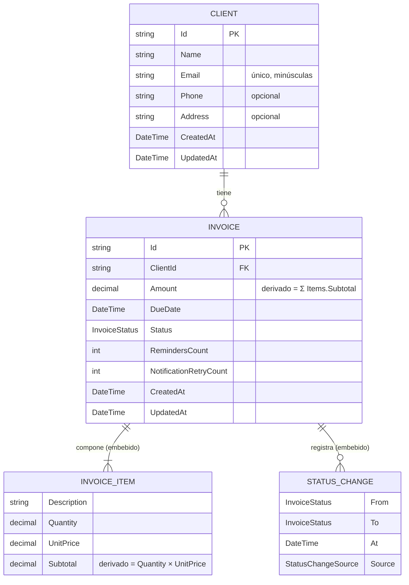

# Modelo de datos — Monolegal

Entidades de dominio (`backend/Domain/Entities`) y su relación. El modelo es documento-orientado:
las líneas de detalle y el historial de estados viven **embebidos** dentro de la factura.

## Diagrama de relación de entidades (ERD)



`SystemSettings` es un documento singleton de configuración sin relación referencial con las
entidades anteriores.

## Entidades

### Client — colección `Clients`

Cliente al que se emiten facturas. `Email` es obligatorio, único entre clientes y se normaliza a
minúsculas; `Phone` y `Address` son opcionales.

### Invoice — colección `Invoices`

Factura emitida a un cliente. `Amount` es **derivado** (suma de subtotales de `Items`). El cambio
de estado es la **única vía** y se registra en `StatusHistory` (lista de `StatusChange`), de modo
que el historial nunca se desincroniza del estado actual. Campos de notificación
(`LastNotificationType/Outcome/At/Error`, `NotificationRetryCount`) registran el resultado del
último aviso por correo y los reintentos del aviso vigente.

### InvoiceItem — *value object* embebido

Línea de detalle inmutable: `Description`, `Quantity` (> 0), `UnitPrice` (> 0) y `Subtotal`
derivado. La factura siempre contiene al menos una línea.

### StatusChange — registro inmutable embebido

Una transición del historial: `From`, `To`, `At` y `Source` (manual o automático).

### SystemSettings — configuración (singleton)

Configuración **no secreta**: plazos de transición (`InvoiceTransitions`), proveedor de correo y
parámetros no secretos (`Email`), y plantillas personalizadas por tipo (`EmailTemplates`). Las
credenciales (password SMTP, API key de Resend) **nunca** se persisten: viven solo en variables de
entorno.

## Enumeraciones (`backend/Domain/Enums`)

| Enum | Valores |
|------|---------|
| `InvoiceStatus` | `Pending`, `PrimerRecordatorio`, `SegundoRecordatorio`, `Desactivado`, `Pagado` |
| `StatusChangeSource` | `Automatic`, `Manual` |
| `NotificationType` | `Reminder`, `PaymentConfirmation`, `DeactivationNotice` |
| `NotificationOutcome` | `None`, `Sent`, `Skipped`, `Failed` |
| `EmailProvider` | `Smtp`, `Resend` |

> Nota: en el documento OpenAPI los estados aparecen en minúsculas (`pending`, `primerrecordatorio`,
> `segundorecordatorio`, `desactivado`, `pagado`).

## Ciclo de estados

```text
Pending → PrimerRecordatorio → SegundoRecordatorio → Desactivado
        ↘ Pagado
```

- El **worker** automatiza las transiciones por tiempo según `InvoiceTransitions`
  (`PendingToFirstReminderDays`, `FirstToSecondReminderDays`, `SecondToDeactivatedDays`).
- La **API** permite transición manual (`POST /api/invoices/transition/{id}`) y registrar el pago
  (`POST /api/invoices/{id}/pay`).
- `Pagado` y `Desactivado` son **terminales**: la factura no admite edición de sus campos.

Ver la [referencia de la API](./api-reference.md) para los endpoints que operan sobre estas entidades.
