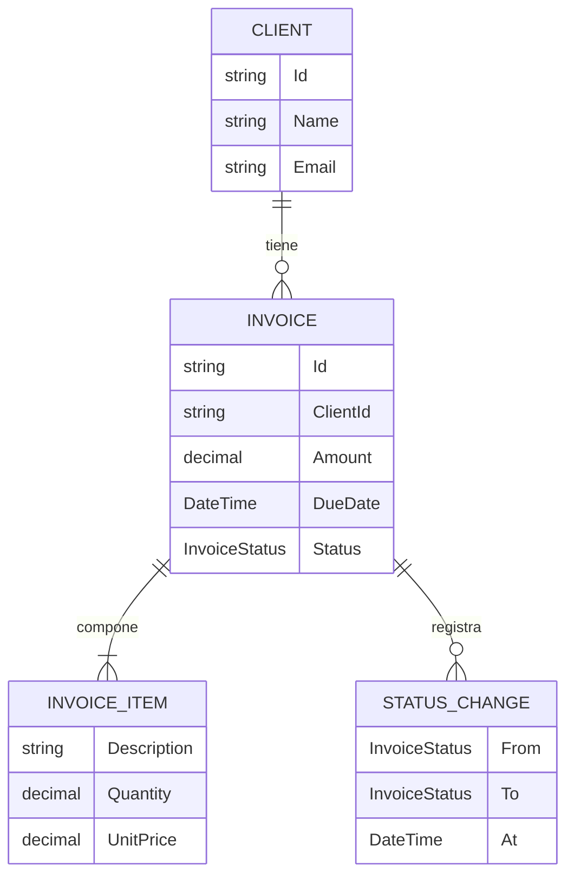

# Data Model — Documentación de API y del Proyecto (Spec 6.1 / 025)

Esta feature **no introduce ni modifica** entidades de dominio: documenta las existentes. Aquí se consolida el modelo que alimentará el ERD de `docs/data-model.md` (entregable FR-002) y los esquemas de la referencia de endpoints. Las entidades reflejan el código en `backend/Domain/Entities`.

## Entidades del dominio (a documentar)

### Client — colección `Clients`

Cliente al que se emiten facturas (spec 018). Email obligatorio, único y normalizado a minúsculas.

| Campo | Tipo | Notas |
|-------|------|-------|
| Id | string | Identificador (GUID "N") |
| Name | string | Obligatorio |
| Email | string | Obligatorio, único, normalizado a minúsculas |
| Phone | string? | Opcional |
| Address | string? | Opcional |
| CreatedAt | DateTime | UTC |
| UpdatedAt | DateTime | UTC |

### Invoice — colección `Invoices`

Factura emitida a un cliente. `Amount` es derivado (Σ subtotales de `Items`). El cambio de estado es la única vía y registra historial.

| Campo | Tipo | Notas |
|-------|------|-------|
| Id | string | Identificador |
| ClientId | string | Referencia a `Client.Id` |
| Amount | decimal | Derivado: Σ `Items[].Subtotal` |
| Items | InvoiceItem[] | Embebido; ≥ 1 línea |
| DueDate | DateTime | Vencimiento |
| Status | InvoiceStatus | Estado actual |
| CreatedAt / UpdatedAt | DateTime | Auditoría UTC |
| RemindersCount | int | Recordatorios enviados |
| LastReminderSentAt | DateTime? | Último recordatorio |
| LastStatusTransitionAt | DateTime | Última transición |
| StatusHistory | StatusChange[] | Embebido; audit log de estados |
| LastNotificationType | NotificationType? | Última notificación intentada |
| LastNotificationOutcome | NotificationOutcome | Resultado (None/Sent/Skipped/Failed) |
| LastNotificationAt | DateTime? | Momento del intento |
| LastNotificationError | string? | Motivo si Failed |
| NotificationRetryCount | int | Reintentos del aviso vigente (spec 019) |

### InvoiceItem — *value object* embebido en `Invoice`

| Campo | Tipo | Notas |
|-------|------|-------|
| Description | string | Obligatorio |
| Quantity | decimal | > 0 |
| UnitPrice | decimal | > 0 |
| Subtotal | decimal | Derivado: `Quantity × UnitPrice` |

### StatusChange — registro inmutable embebido en `Invoice.StatusHistory`

| Campo | Tipo | Notas |
|-------|------|-------|
| From | InvoiceStatus | Estado origen |
| To | InvoiceStatus | Estado destino |
| At | DateTime | Momento (UTC) |
| Source | StatusChangeSource | Manual / Automatic |

### SystemSettings — colección de configuración (singleton)

Configuración **no secreta** del sistema (spec 017). Las credenciales (password SMTP, API key Resend) viven solo en variables de entorno.

| Campo | Tipo | Notas |
|-------|------|-------|
| Id | string | Documento único |
| InvoiceTransitions | InvoiceTransitionsConfig | Días por transición |
| Email | EmailSettings | Proveedor activo, remitente, SMTP/Resend (no secreto) |
| EmailTemplates | Dictionary<NotificationType, EmailTemplate> | Plantillas personalizadas; vacío ⇒ defaults |
| UpdatedAt | DateTime | Auditoría |

## Enumeraciones (referencia, en `backend/Domain/Enums`)

- **InvoiceStatus**: `Pending`, `PrimerRecordatorio`, `SegundoRecordatorio`, `Pagado`, `Desactivado`.
- **StatusChangeSource**: `Manual`, `Automatic`.
- **NotificationType**, **NotificationOutcome**, **EmailProvider**: documentar valores tal como los define el dominio.

> Los valores exactos de los enums se toman de `backend/Domain/Enums` al redactar `docs/data-model.md`, para evitar divergencias.

## Relaciones (para el ERD)

- **Client 1 — \* Invoice**: una factura referencia a un cliente vía `Invoice.ClientId`.
- **Invoice 1 — \* InvoiceItem**: líneas de detalle embebidas (composición).
- **Invoice 1 — \* StatusChange**: historial de estados embebido (composición).
- **SystemSettings**: singleton de configuración, sin relación referencial con las anteriores.

## Estado de transiciones (contexto de la API)

`Pending → PrimerRecordatorio → SegundoRecordatorio → Desactivado`; `Pagado` y `Desactivado` son terminales (sin edición). El worker automatiza transiciones por tiempo; la API permite transición manual (`POST /api/invoices/transition/{id}`) y pago (`POST /api/invoices/{id}/pay`).

## Nota sobre "entidades" propias de esta feature

Los artefactos de documentación (documento de arquitectura, ERD, referencia de endpoints, guía setup/deployment, colección Postman, acceso a Swagger) se describen como entregables y contratos en `contracts/`, no como entidades persistidas.
